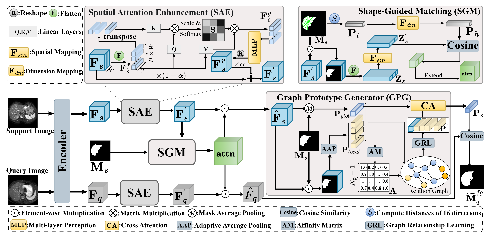

# SPA: Shape-aware Prototype Acquisition for Cross-Domain Few-Shot Medical Image Segmentation

## 🚩Abstract
Few-Shot Medical Image Segmentation (FSMIS) has emerged as a vital solution to data scarcity, yet it suffers from severe generalization degradation when transferred to unseen domains with distinct imaging physics. Existing cross-domain approaches primarily focus on aligning low-level frequency or implicit feature statistics. However, they often overfit volatile texture patterns while neglecting the anatomical topological shape, which exhibits inherent and robust invariance across heterogeneous modalities. To this end, we propose a novel Shape-aware Prototype Acquisition (SPA) framework, which explicitly establishes anatomical shape information as a physical anchor to bridge the domain gap. Specifically, we first design a Spatial Attention Enhancement (SAE) module to suppress domain-specific texture noise, purifying the feature space for effective enhancement. Subsequently, a Shape-Guided Matching (SGM) module is introduced to disentangle domain-invariant structural representations from the entangled features via explicit anatomical shape constraints. Furthermore, to overcome the structural loss in standard pooling, we propose a Graph Prototype Generator (GPG) that constructs intra-class topological relationships via graph construction to generate robust prototypes. Extensive experiments on three public medical imaging datasets demonstrate that SPA significantly outperforms state-of-the-art methods.

## 🔍Overview of SPA



## 🗝️Quick Start
### 🔖1. Dependencies
Please install the following dependencies:

```python
dcm2nii
json5==0.8.5
jupyter==1.0.0
nibabel==2.5.1
numpy==1.24.4
opencv_python==4.11.0.86
Pillow>=8.1.1
sacred==0.8.7
scikit_learn==1.3.2
scikit-image==0.18.3
SimpleITK==2.5.2
torch==2.4.1
torchvision==0.19.1
matplotlib==3.7.5
scipy==1.16.0
```

### 📋2. Datasets and Pre-processing
1. Download Datasets:
+ Abdomen MRI：[Combined Healthy Abdominal Organ Segmentation dataset](https://chaos.grand-challenge.org/)
+ Abdomen CT：[Multi-Atlas Abdomen Labeling Challenge](https://www.synapse.org/#!Synapse:syn3193805/wiki/218292)
+ <font style="color:rgb(31, 35, 40);">Cardiac LGE and b-SSFP</font>：[Multi-sequence Cardiac MRI Segmentation dataset](https://zmiclab.github.io/zxh/0/mscmrseg19/index.html)
+ <font style="color:rgb(31, 35, 40);">Prostate UCLH and NCI</font>：[Cross-institution Male Pelvic Structures](https://zenodo.org/records/7013610)
2. Data Pre-processing:
+ <font style="color:rgb(31, 35, 40);">Pre-processing is performed according to </font>[<font style="color:rgb(9, 105, 218);">Ouyang et al.</font>](https://github.com/cheng-01037/Self-supervised-Fewshot-Medical-Image-Segmentation/tree/2f2a22b74890cb9ad5e56ac234ea02b9f1c7a535)<font style="color:rgb(31, 35, 40);"> and we follow the procedure on their GitHub repository.</font>
3. Directory Structure:
    The final data should be stored in the `./data` directory. The structure is as follows:

```python
./data
├── ABD
│   ├── ABDOMEN_CT
│   │   ├── sabs_CT_normalized
│   │   └── supervoxels_5000
│   └── ABDOMEN_MR
│       ├── chaos_MR_T2_normalized
│       └── supervoxels_5000
├── Cardiac
│   ├── bSSFP
│   │   ├── cmr_bssFP_normalized
│   │   └── supervoxels_5000
│   ├── LGE
│   │   ├── cmr_LGE_normalized
│   │   └── supervoxels_5000
├── Prostate
│   ├── NCI
│   │   ├── tcia_p3t_normalized
│   │   └── supervoxels_......
│   └── UCLH
│       ├── biopsy_normalized
│       └── supervoxels_.......

```

### 📍3. Download ResNet Pre-trained Weights
| resnet50-imagenet | [https://download.pytorch.org/models/resnet50-19c8e357.pth](https://download.pytorch.org/models/resnet50-19c8e357.pth) |
| --- | --- |
| resnet50-coco | [https://download.pytorch.org/models/deeplabv3_resnet50_coco-cd0a2569.pth](https://download.pytorch.org/models/deeplabv3_resnet50_coco-cd0a2569.pth) |
| resnet101-imagenet | [https://download.pytorch.org/models/resnet101-63fe2227.pth](https://download.pytorch.org/models/resnet101-63fe2227.pth) |
| resnet101-coco | [https://download.pytorch.org/models/deeplabv3_resnet101_coco-586e9e4e.pth](https://download.pytorch.org/models/deeplabv3_resnet101_coco-586e9e4e.pth) |


1. Download the [resnet50-coco](https://download.pytorch.org/models/resnet101-63fe2227.pth) weights as our pre-trained model.。
2. Create a `checkpoint` directory and place the downloaded model inside it. The directory structure should look like this:

```python
\checkpoint
└── deeplabv3_resnet50_coco-cd0a2569.pth
```

### 🔥 4. Training and Inference
There are 6 training tasks:
1. Abdomen CT (train)-> MR(inference)
2. Abdomen MR (train)-> CT(inference)
3. Cardiac LGE(train) -> bSSFP(infernce)
4. Cardiac bSSFP (train) -> LGE(inference)
5. Prostate NCI (train) -> UCLH(inference)
6. Prostate UCLH (train) -> NCI (inference)

The training and inference commands for each task are listed in the table below:

| | Task | Training Command | Inference Command |
| --- | --- | --- | --- |
| 1.  | CT-> MR | ./scripts/train_on_ABDOMEN_CT.sh | ./scripts/test_ABDOMEN_CT2MR.sh |
| 2.  | MR->CT | ./scripts/train_on_ABDOMEN_MR.sh | ./scripts/test_ABDOMEN_MR2CT.sh |
| 3.  | LGE -> bSSFP | ./scripts/train_on_Cardiac_LGE.sh | ./scripts/test_Cardiac_LGE2bssFP.sh |
| 4.  | bSSFP -> LGE | ./scripts/train_on_Cardiac_bSSFP.sh | ./scripts/test_Cardiac_bssFP2LGE.sh |
| 5.  | NCI -> UCLH | ./scripts/train_on_Prostate_NCI.sh | ./scripts/test_Prostate_NCI2UCLH.sh |
| 6.  | UCLH -> NCI | ./scripts/train_on_Prostate_UCLH.sh | ./scripts/test_Prostate_UCLH2NCI.sh |


Taking CT->MR as an example:

Training：

```Bash
./scripts/train_on_ABDOMEN_CT.sh # Ensure the file has execution permissions
```

Inference：

```Bash
./scripts/test_ABDOMEN_CT2MR.sh
```

## 🌹Acknowledgements
<font style="color:rgb(31, 35, 40);">Our code is built upon the works of </font>[<font style="color:rgb(9, 105, 218);">SSL-ALPNet</font>](https://github.com/cheng-01037/Self-supervised-Fewshot-Medical-Image-Segmentation)<font style="color:rgb(31, 35, 40);">, </font>[<font style="color:rgb(9, 105, 218);">ADNet</font>](https://github.com/sha168/ADNet)<font style="color:rgb(31, 35, 40);"> and </font>[<font style="color:rgb(9, 105, 218);">QNet</font>](https://github.com/ZJLAB-AMMI/Q-Net)<font style="color:rgb(31, 35, 40);">, we appreciate the authors for their excellent contributions!</font>

